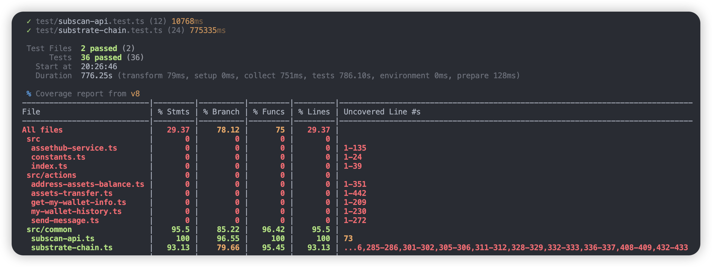

## Test Guide
### 1. Automated Testing
#### Install dependencies
```
pnpm install
```

#### Run test cases and generate coverage report
```
pnpm run coverage
```

output for example:

```

 ✓ test/subscan-api.test.ts (12) 10768ms
 ✓ test/substrate-chain.test.ts (24) 775335ms

 Test Files  2 passed (2)
      Tests  36 passed (36)
   Start at  20:26:46
   Duration  776.25s (transform 79ms, setup 0ms, collect 751ms, tests 786.10s, environment 0ms, prepare 128ms)

 % Coverage report from v8
----------------------------|---------|----------|---------|---------|------------------------------------------------------------------------------
File                        | % Stmts | % Branch | % Funcs | % Lines | Uncovered Line #s                                                            
----------------------------|---------|----------|---------|---------|------------------------------------------------------------------------------
All files                   |   29.37 |    78.12 |      75 |   29.37 |                                                                              
 src                        |       0 |        0 |       0 |       0 |                                                                              
  assethub-service.ts       |       0 |        0 |       0 |       0 | 1-135                                                                        
  constants.ts              |       0 |        0 |       0 |       0 | 1-24                                                                         
  index.ts                  |       0 |        0 |       0 |       0 | 1-39                                                                         
 src/actions                |       0 |        0 |       0 |       0 |                                                                              
  address-assets-balance.ts |       0 |        0 |       0 |       0 | 1-351                                                                        
  assets-transfer.ts        |       0 |        0 |       0 |       0 | 1-442                                                                        
  get-my-wallet-info.ts     |       0 |        0 |       0 |       0 | 1-209                                                                        
  my-wallet-history.ts      |       0 |        0 |       0 |       0 | 1-230                                                                        
  send-message.ts           |       0 |        0 |       0 |       0 | 1-272                                                                        
 src/common                 |    95.5 |    85.22 |   96.42 |    95.5 |                                                                              
  subscan-api.ts            |     100 |    96.55 |     100 |     100 | 73                                                                           
  substrate-chain.ts        |   93.13 |    79.66 |   95.45 |   93.13 | ...6,285-286,301-302,305-306,311-312,328-329,332-333,336-337,408-409,432-433 
----------------------------|---------|----------|---------|---------|----------------------------------------------------------------------------
```


### 2. Manual Testing
