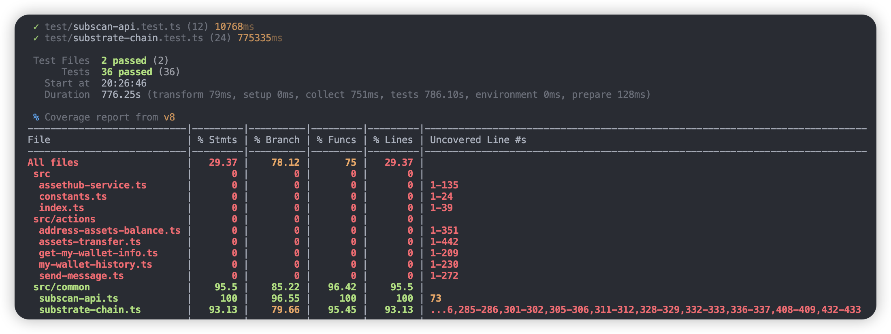

## Test Guide

### Clone Project

```
git clone https://github.com/ChainSupport/eliza-plugin-dot.git
cd eliza-plugin-dot
git fetch origin m1
git switch m1
```
### 1. Automated Testing
#### Install dependencies
```
pnpm install
```

### Environment Configuration

```
cp vitest.env.example vitest.env 
```
> You can use my configuration (strongly recommended to use my configuration directly, so you don't need to transfer DOT and DOTA to these two accounts, as they currently have sufficient balance for testing), or you can modify it and use your own. Note that Alice and Bob accounts should have DOT or DOTA balance, which are used for Native DOT and Assets transfer testing respectively.


#### Run test cases and generate coverage report
```
pnpm run coverage
```

output for example:

```

 ✓ test/subscan-api.test.ts (12) 10207ms
 ✓ test/substrate-chain.test.ts (24) 518378ms

 Test Files  2 passed (2)
      Tests  36 passed (36)
   Start at  20:31:41
   Duration  519.37s (transform 75ms, setup 0ms, collect 788ms, tests 528.59s, environment 0ms, prepare 120ms)

 % Coverage report from v8
---------------------------------|---------|----------|---------|---------|------------------------------------------------------
File                             | % Stmts | % Branch | % Funcs | % Lines | Uncovered Line #s                                    
---------------------------------|---------|----------|---------|---------|------------------------------------------------------
All files                        |   27.94 |    74.52 |   74.35 |   27.94 |                                                      
 src                             |   12.06 |        0 |       0 |   12.06 |                                                      
  assethub-service.ts            |       0 |        0 |       0 |       0 | 1-135                                                
  constants.ts                   |     100 |      100 |     100 |     100 |                                                      
  index.ts                       |       0 |        0 |       0 |       0 | 1-40                                                 
 src/actions                     |       0 |        0 |       0 |       0 |                                                      
  address-assets-balance.ts      |       0 |        0 |       0 |       0 | 1-352                                                
  assets-transfer.ts             |       0 |        0 |       0 |       0 | 1-443                                                
  get-my-wallet-info.ts          |       0 |        0 |       0 |       0 | 1-210                                                
  get_transfer_detail_by_hash.ts |       0 |        0 |       0 |       0 | 1-272                                                
  my-wallet-history.ts           |       0 |        0 |       0 |       0 | 1-232                                                
  send-message.ts                |       0 |        0 |       0 |       0 | 1-273                                                
 src/common                      |   92.35 |    81.44 |   96.66 |   92.35 |                                                      
  subscan-api.ts                 |   98.48 |    89.65 |     100 |   98.48 | 141-142,180-181                                      
  substrate-chain.ts             |   89.46 |    77.94 |   95.83 |   89.46 | ...3,329-330,333-334,387-396,440-441,464-465,480-489 
 src/utils                       |       0 |        0 |       0 |       0 |                                                      
  timestamp.ts                   |       0 |        0 |       0 |       0 | 1-4                                                  
---------------------------------|---------|----------|---------|---------|------------------------------------------------------
➜  plugin-dot git:(m1) ✗ 

```

> Note: This project’s core code resides in `subscan-api.ts`, and it already has full automated test coverage. The remaining modules—such as the files under `src/actions` and `assethub-service`—should be exercised manually within the agent environment. We have completed comprehensive manual verification and all features work as expected. If you want to repeat the manual checks, please follow the guide in [Manual Testing](#2-manual-testing).

### 2. Manual Testing
[Polkadot Asset Hub Agent test guide](https://github.com/ChainSupport/eliza/blob/main/docs/test-guide.md)

